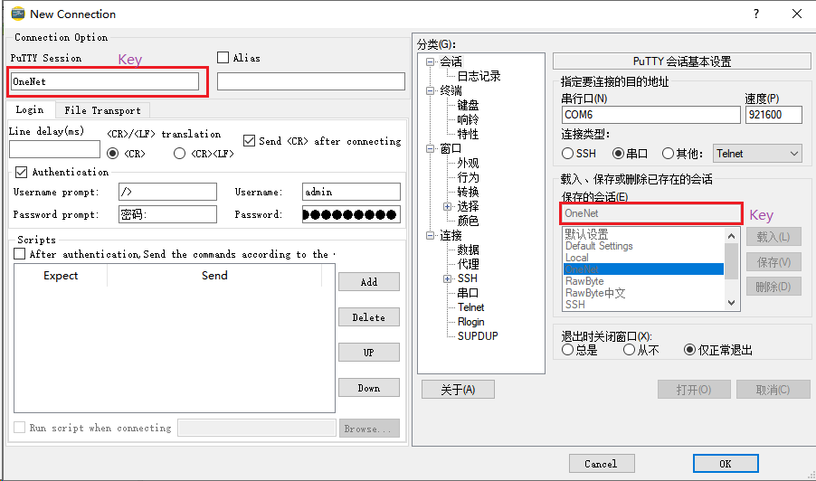

# PuTTYAttach

PuTTYAttach是一个基于Windows的应用程序，用于多标签管理PuTTY终端。

支持自动登录,登录脚本，支持XModem，YModem，ZModem协议传输文件。

## 背景

一个量产很久的设备包含一个简单的串口终端，包含YModem协议支持上传和下载文件，一直使用免费版XShell交互很完美。

近期需要让其支持TCP连接的远程终端，XShell的支持就不那么好了，需要找其他终端工具替代。

找了好几个终端工具，发现PuTTY是最合适的一个，支持串口，TCP-RAW，命令交互很完美，美中不足的是PuTTY原生不支持YModem协议，会话管理不是很便捷。

在github找到一个工具superPuTTY: https://github.com/jimradford/superputty . 可以管理PuTTY会话。

在研究YModem协议时，找到开源工具 lrzsz: https://github.com/trzsz/lrzsz-win32 . 支持XModem，YModem，ZModem，很多Linux SSH连接也支持此工具。

是否可以开发一个软件，把superPuTTY 和 lrzsz 糅合在一起，满足设备交互的终端工具？于是有了PuTTYAttach。

## 特点

1.多标签管理PuTTY终端 ，

2.管理PuTTY会话，支持分组和层次组合。

3.连接后自动身份认证。

4.登录后自动发送命令序列。

5.集成外部工具。

6.Python脚本支持(V1.0版本不支持，计划以面版本实现)。

7.整合lrzsz，支持XModem，YModem，ZModem协议下载和上传文件。

【注】

1-5 是PuTTYAttach 基础功能，适配原始的PuTTY终端和变种的PuTTY终端。

6-7 是扩展功能，需要pipPuTTY协同。

7 需要lrzsz协同。

| 功能                         | 原始PuTTY | pipPuTTY |
| ---------------------------- | --------- | -------- |
| 会话管理                     | ●         | ●        |
| 多标签                       | ●         | ●        |
| 自动身份认证(提示方式)       |           | ●        |
| 自动身份认证(延时方式)       | ●         | ●        |
| 自动发送命令序列(Expect方式) |           | ●        |
| 自动发送命令序列(延时方式)   | ●         | ●        |
| 脚本                         |           | ●        |
| 文件传输(XYZModem)           |           | ●        |

pipPuTTYcn: https://github.com/hfcjx/pipPuTTYcn

pipPuTTYen: https://github.com/hfcjx/pipPuTTYen 

lrzsz: https://github.com/hfcjx/lrzsz 

lrzsz-win32: https://github.com/trzsz/lrzsz-win32

## 实现

**多标签**

PuTTY是独立程序，基于QT开发GUI程序，以子进程启动PuTTY很容易嵌入到QT窗口中。

每个连接的PuTTY终端窗口，内嵌到QT多标签控件中即可实现会话多标签显示。

**会话管理**

会话管理分成两部分，一部分是PuTTY自身会话参数(参数1)，一部分是PuTTYAttach会话参数(参数2)。

参数1是PuTTY终端连接相关的参数，由PuTTY维护，一般保存在./sessions目录或注册表中。

参数2是会话扩展功能参数，如自动身份验证，序列命令发送，文件传输等。

会话的增删查改都需要考虑参数1和参数2的同步问题。

使用子进程窗口内嵌功能，把参数1和参数2两个参数配置界面在一个窗口中显示，如此可降低会话同步的复杂性。

如何把参数1和参数2关联起来？通过会话名称。

参数2以会话名称为索引保存在./session.json中，参数1是PuTTY维护，以会话名称载入，保存，删除，连接等，因此选择会话名作为关键字是合适的。

选取关键字后，带出另一个问题，如何控制PuTTY会话的载入，保存，删除？

PuTTYAttach选择调用Windows API函数SendMessage在PuTTYAttach与PuTTY之间交互，控制PuTTY载入，保存，删除会话。

如此可以实现会话管理---会话增删查改参数的同步问题。

【注】 采用SendMessage交互，除了pipPuTTY可用，原始PuTTY和其他PuTTY的分支同样可用，如KiTTY等。

**文件传输**

lrzsz是开源软件，实现XModem，YModem，ZModem，已经非常成熟可靠。使用lrzsz实现XModem，YModem，ZModem实现文件传输是非常理想的选择。

lrzsz是独立程序，PuTTY也是独立程序，如何连接两个程序实现文件传输？马上想出主意是PuTTYAttach作为桥梁连接lrzsz和PuTTY。

浏览lrzsz源码，通过标准输入输出接收和发送数据，因此启动lrzsz子进程时必须对标准输入输出重定向。

PuTTY是GUI程序没有标准输入输出，无法作为数据接收发送管道。对PuTTY改造，增加标准输入输出接收和发送数据，因此就有了[pipPuTTY](https://github.com/hfcjx/pipPuTTYcn).

整个流程如下：

1) PuTTYAttach创建匿名管道。

2) 启动PuTTY子进程，重定向到匿名管道。

3) 启动lrzsz子进程，重定向到匿名管道。
   
4) 文件传输开始。

**身份认证和登录命令发送**

身份认证和登录命令发送在开始的规划，是调用SendMessage模拟键盘按键方式发送给PuTTY，这方法非常通用可支持原始PuTTY和其他PuTTY的分支。

[pipPuTTY](https://github.com/hfcjx/pipPuTTYcn) 增加标准输入输出管道，可以把远端服务器发送的数据转发到PuTTYAttach，PuTTYAttach也可通过管道向远端服务器发送消息。

这就可以衍生很多有意思的扩展功能：

1) 等待远程服务器返回关键字。

检测远程服务器发送的字符，抓取关键字触发身份认证的用户名和密码发送；触发命令发送。

2) 脚本

移植脚本语言解析器，可以运行自动化脚本与远程服务器交互。(V1.0版本不支持，计划后续版本实现。)
