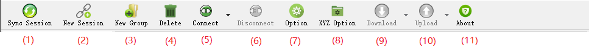
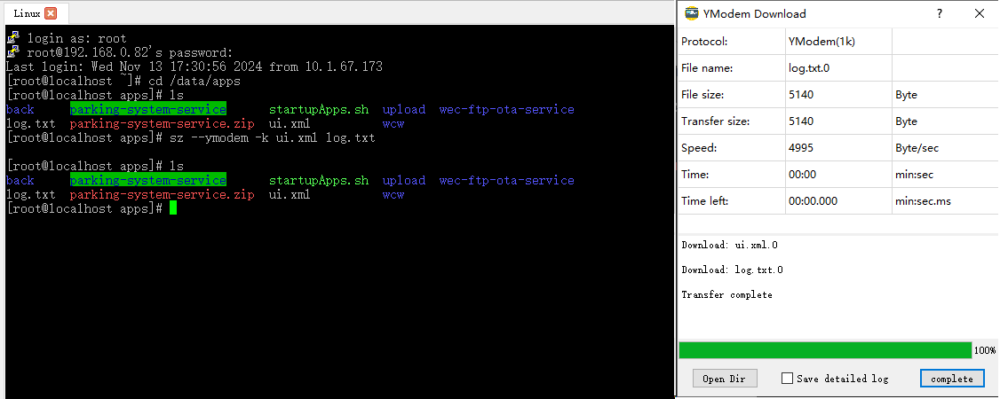
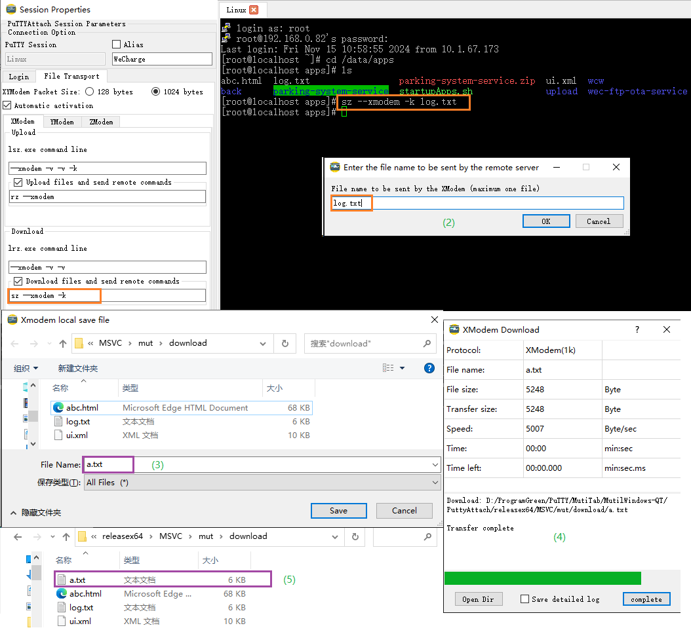
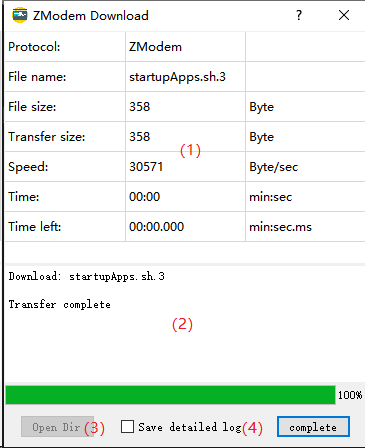

[中文](/help.md)

# PuTTYAttach Help Documentation

## 1. Main Page

The main page of **PuTTYAttach** is as follows:

(1) **Menu Bar**
(2) **Toolbar**
(3) **PuTTY Session List**
(4) **Connected PuTTY Terminal**
(5) **Status Bar**: Displays a brief configuration of the PuTTY session.

### 1.1 Toolbar

**(1) Sync Sessions**
Sync the PuTTY sessions to PuTTYAttach.

PuTTY is an external standalone program that can directly manage its own sessions (usually saved in the `./sessions` directory or the registry).
Sometimes the sessions saved in PuTTYAttach may not sync with the PuTTY sessions. The "Sync Sessions" will sync PuTTY's sessions to PuTTYAttach.

**(2) New Session**
Create a new PuTTYAttach session and create the session in PuTTY as well.

**(3) New Group**
Create a folder in the session list to group and manage sessions.

**(4) Delete**
Delete the selected PuTTYAttach session or session group (folder).

**(5) Connect**
Connect to the selected session in the session list or the session from the drop-down menu.

**(6) Disconnect**
Disconnect the currently connected terminal in the active tab.

**(7) Option**
Main configuration settings for PuTTYAttach.

**(8) XYZ Option**
Settings for external lrzsz program configuration.

**(9) File Download**
Download files using XModem, YModem, ZModem protocols. Requires work with [pipPuTTY](https://github.com/hfcjx/pipPuTTYcn) and lrzsz.

**(10) File Upload**
Upload files using XModem, YModem, ZModem protocols. Requires work with [pipPuTTY](https://github.com/hfcjx/pipPuTTYcn) and lrzsz.

**(11) About**
About dialog for PuTTYAttach.

### 1.2 Menu Bar

The menu bar is essentially the same as the toolbar, with the following two additional menus:

**(1) PuTTYAttach Page Layout Settings**

- Hide or show the "Session List"
- Hide or show the "Toolbar"
- Hide or show the "Menu Bar"

**(2) External Tools**
Commonly used tools or shortcuts can be copied to the `./exTools` directory, and PuTTYAttach will add them to this menu for quick access to the corresponding software.

### 1.3 Session List

The session list on the left side of the main page displays PuTTYAttach sessions saved in the `./session.json` file. Sessions can be grouped by creating folders.

- Double-click a session to connect.
- Double-right-click to modify the session configuration.
- Double-middle-click to copy the session and create a new one.

### 1.4 Multi-tab Interface

**(1)** Right-click the tab header to bring up the PuTTY system menu.

**(2)** Drag and drop files into the terminal window to open the file upload menu.
(Note: Requires work with [pipPuTTY](https://github.com/hfcjx/pipPuTTYcn))

## 2. Option

All Option parameters are saved in the `./setting.json` file.

**(1)** Path to the PuTTY executable. Relative paths are also valid.

**(2)** Directory where PuTTY session files are saved.
[PuTTY for Win32 storing configuration into file](https://jakub.kotrla.net/putty/) allows PuTTY's session data to be stored in files instead of the registry. This is where those session files are located. The default directory is the `sessions` folder under the same directory as `putty.exe`.

**(3)** Wait time for PuTTY.exe to start.
If PuTTY.exe doesn't start within the specified time, PuTTYAttach will consider it a failure to start PuTTY.

**(4)** Save upon exit:

- **Program Layout**: Save the layout settings for "Session List", "Toolbar", and "Menu Bar".
- **Open Sessions**: Save the sessions that were open when PuTTYAttach was closed.

**(5)** Delete PuTTY sessions as well:

When deleting a session, the session option parameters  in the `./session.json` file will be deleted. If this option is enabled, PuTTYAttach will start putty.exe to  delete the session from PuTTY's internal storage.

**(6)** Internationalization:

The default language for PuTTYAttach is Chinese, but an English translation has been completed.
The translation file `english.qm` was done through Google Translate, so the accuracy may not be perfect. Feel free to modify the translation file if necessary.
To add other languages, use QT Creator's translation tool to create new `.qm` files and place them in the `./translations` directory. The language option will appear in the "Language" menu.

## 3. New Session

**(1)** **Session Name**
This is an important parameter. The session name in the `./session.json` file links to PuTTY's session name.
The session name will be synced to PuTTY’s session name input field, and PuTTY will save its session under this name.

**(2)** **Alias**
The terminal tab header displays the session name by default.
By setting an alias and checked the option, the tab will display the alias instead.

**(3)** **Line Delay**
The communication line delay. This affects the interval between sending the username, password, and command sequences.

**(4)** **Command <CR>/<LF> Conversion**
Commands by default end with `<CR>`. If `<CR><LF>` is selected, commands will end with `<CR><LF>` when sent to the remote server.

**(5)** **Send <CR> After Connection**
Some servers (e.g., serial communication) may not trigger the authentication prompt automatically.
This setting sends a `<CR>` after the connection to trigger automatic login and command sequence sending.

**(6)** **Authentication**
If checked, the terminal will automatically send the username and password for authentication after connection.

**(7)** **Send Command Sequence**
If checked, a sequence of commands will be sent after authentication.

**(8)** **Run Script After Connection**
Run a script after authentication. This feature is not yet supported in version 1.0 but is planned for future releases.

**(9)** **PuTTY Configuration Interface**
Configure PuTTY's session parameters, just as you would with standalone PuTTY.

**(10)** **File Transfer**
Settings related to file transfers using XModem, YModem, and ZModem. Requires integration with [pipPuTTY](https://github.com/hfcjx/pipPuTTYcn) and lrzsz.

### 3.1 Automatic Authentication

There are two modes for automatic authentication: **Prompt Mode** and **Delay Mode**.

#### **3.1.1 Prompt Mode**

- **Username Prompt**: The remote server sends a prompt for the username (e.g., "login as:").
- **Password Prompt**: The remote server sends a prompt for the password (e.g., "password:").

After the terminal connects, PuTTYAttach waits for the username prompt and  sends the username, waits for the password prompt and sends the password to complete authentication.

**Note**
This mode requires work with [pipPuTTY](https://github.com/hfcjx/pipPuTTYcn).

PuTTYAttach will continue waiting for prompts. In some cases, it may wait indefinitely and not proceed with the **automatic command sequence**. To exit the wait, press two consecutive **Enter**.

#### **3.1.2 Delay Mode**

The "Username Prompt" and "Password Prompt" fields are left blank.

After the terminal connects, the username is sent, waits for twice the line delay time and sends the password to complete authentication.

**Note:**

PuTTYAttach sends passwords to PuTTY by simulating keyboard keystrokes, because passing passwords on the command line is a direct leak.

### 3.2 Auto-Send Command Sequence

1. **Add Button**: Adds a new row to the command sequence.
2. **Delete Button**: Deletes the selected row from the sequence.
3. **Up Button**: Moves the selected row up in the sequence.
4. **Down Button**: Moves the selected row down in the sequence.
5. **Expect Column**: The string waits for before sending the command in the "Send" column. If this column is empty, commands are sent sequentially with a line delay between them.
6. **Send Column**: The actual command to be sent.

- If the **Expect Column** is empty, commands will be sent sequentially with a line delay.

- If the **Expect Column** contains a string,  PuTTYAttach  will wait for that string to appear before sending the command.

- PuTTYAttach  send string by simulating key presses. 

  

  You can exit the expect string  waiting state by press two consecutive **Enter**, which will stop the sequence and prevent further commands from being sent.

The following figure shows the configuration and actual example of **Automatic Authentication** and **Automatic Sending of Command Sequence**:

### 3.3 Login Script

- The **Login Script** feature is not supported in version 1.0 but is planned for future versions.
- It will require workwith **pipPuTTY**.

### 3.4 XYZModem

#### 3.4.1 Configuration

1. **File Upload Settings**:

   - **"lsz.exe Command Line"**:
     Command-line arguments for launching `lsz.exe`. The meaning of these parameters can be viewed by running `lsz --help`.
   - **"Upload File Send Remote Command"**:
     If this option is checked, PuTTYAttach will start XYZModem file upload and send this command to the remote server to initiate the XYZModem file receive process, completing the file transfer automatically.

2. **File Download Settings**:

   - **"lrz.exe Command Line"**:
     Command-line arguments for launching `lrz.exe`. The meaning of these parameters can be viewed by running `lrz --help`.
   - **"Download File Send Remote Command"**:
     If this option is checked, PuTTYAttach will start XYZModem file download and send this command to the remote server to initiate the XYZModem file send process, completing the file transfer automatically.

3. **XYModem Packet Size**:
   This setting applies to XModem and YModem protocols only. It defines the size of the file transfer packet, which can be either 128 bytes or 1024 bytes.

4. **Auto Activation**:
   If this option is checked, PuTTYAttach will monitor commands entered into the terminal.
   If a command matches either the **"Upload File Send Remote Command"** or **"Download File Send Remote Command"** (regardless of the order), PuTTYAttach will trigger the corresponding file transfer.

   

   If the **"Upload File Send Remote Command"** or**"Download File Send Remote Command"** are empty, PuTTYAttach  will automatically match commands against the default `lrzsz` commands: `--xmodem` or `--ymodem`.

   If a match is found, PuTTYAttach will trigger the local `lrzsz` utility to complete the file transfer.

**Note**:
The ZModem protocol matches the protocol frame header and does not rely on the **"Upload File Send Remote Command"** or **"Download File Send Remote Command"** settings.

#### 3.4.2 Automatic File Transfer

##### **3.4.2.1 Remote Initiation**

When the terminal enters the `lrzsz` command to start the file transfer, PuTTYAttach will initiate the local `lrzsz`, which is called **Remote Initiated File Transfer**.

If **Auto Activation** is enabled, when the terminal enters the `lrzsz` command, PuTTYAttach will automatically detect and trigger the local `lrzsz`, completing the file transfer automatically.

###### 1 **File Upload**

1. The terminal enters the command **"rz --ymodem -E"** to start remote YModem file reception.
2. PuTTYAttach will pop up the **"Select Upload File"** window, where you can choose the file to upload.
3. The **File Upload and Download** window will pop up  to complete the file transmission.

The process is shown in the image below:

###### 2 **File Download**

1. The terminal enters the command **"sz --ymodem -k ui.xml log.txt"** to start remote YModem file sending.
2. The **File Upload and Download** window will pop up to  completing the file reception .

The process is shown in the image below:

##### **3.4.2.2 Local Initiation**

PuTTYAttach initiates the local `lrzsz` and automatically sends the `lrzsz` command to start the remote file transfer. This is called **Local Initiated File Transfer**.

**"Upload File Send Remote Command"** and **"Download File Send Remote Command"** is checked, PuTTYAttach will automatically send the command to the remote server and complete the file transfer automatically.

###### 1 **File Upload**

1. In PuTTYAttach, select the **ZModem Upload** from the menu.
2. PuTTYAttach will pop up the **"Select Upload File"** window,  select the file to upload.
3. PuTTYAttach automatically sends the **"Upload File Send Remote Command"** to the remote server.
4. The **File Upload and Download** window will pop up to complete the file transfer.

The process is shown in the image below:

**Note**: The XModem protocol cannot transfer file names. The **"Enter the remote save file name"** window will pop up to input the file name for the remote save. The file name will be automatically appended to the **"Upload File Send Remote Command"** and sent to the remote server.

###### 2 **File Download**

1. In PuTTYAttach, select **XModem Download** from the menu.

2. PuTTYAttach will pop up the **"Enter Remote File to Send"** window, where you can enter the name of the file to download. 

   PuTTYAttach will automatically append the file name to the **"Download File Send Remote Command"** and send it to the remote server.

3. PuTTYAttach will pop up the **"XModem Local Save File"** window, where you enter the local file name for saving (YModem and ZModem do not have this step).

4. The **File Upload and Download** window will pop up  to complete the file reception.

5. The file will be successfully received and saved as "a.txt" in the download directory.

The process is shown in the image below:

## 4. lrzsz File Transfer Settings

All parameters are saved in the `./setting.json` file.

1. **Default Directory for Saving Downloaded Files**
2. **Path to lrz.exe**
3. **Path to lsz.exe**
4. **Choose to save the full path for each downloaded file**
5. **Automatically rename files if a file with the same name exists during download** This corresponds to the `-E` command-line argument for `lrz.exe`.

------

## 5. File Upload and Download Window

1. **Transfer Process Information**: Displays the current transfer status.
2. **Exception or Event Information**: Displays any errors or events during transfer.
3. **Open Download Directory **: After the download finishes, click the button to open the directory where the file was saved.
4. **Save lrzsz log **:If checked，after Closing the Window lrzsz’s redundant information will be saved to a file named `PuttyAttach_lrzszLog.txt` located in the same directory as lrzsz.

## **Appendix**

### (1) Difference Between Original PuTTY and pipPuTTY:

pipPuTTY extends PuTTY by enabling interaction with external programs for input and output data, adding the following features:

1. Prompt-based identity authentication and command sending
2. File upload and download

| Feature                                           | Original PuTTY | pipPuTTY |
| ------------------------------------------------- | -------------- | -------- |
| Session Management                                | ●              | ●        |
| Tabbed Interface                                  | ●              | ●        |
| Automatic Identity Authentication (Prompt-based)  |                | ●        |
| Automatic Identity Authentication (Delayed)       | ●              | ●        |
| Automatic Command Sequence Sending (Expect-based) |                | ●        |
| Automatic Command Sequence Sending (Delayed)      | ●              | ●        |
| Scripting                                         |                | ●        |
| File Transfer (XYZModem)                          |                | ●        |

------

### (2) Difference Between [lrzsz-win32](https://github.com/trzsz/lrzsz-win32) and [lrzsz-pip](https://github.com/hfcjx/lrzsz)

- **lrzsz-win32** is the original version of lrzsz compiled for Windows (Win32).
- Both **[lrzsz-win32](https://github.com/trzsz/lrzsz-win32)** and **[lrzsz-pip](https://github.com/hfcjx/lrzsz)** can work with PuTTYAttach to upload and download files.
- **[lrzsz-pip](https://github.com/hfcjx/lrzsz)** improves on the original lrzsz by refining the redundant information printed during XModem, YModem, and ZModem transfers, and provides more detailed transfer process information in the file upload and download window.

------

### (3) PuTTYAttach Release

- **[hfcjx/PuTTYAttach: PuTTYAttach is a Windows-based application for managing PuTTY sessions with tabbed interface and supports automatic login](https://github.com/hfcjx/PuTTYAttach)**
