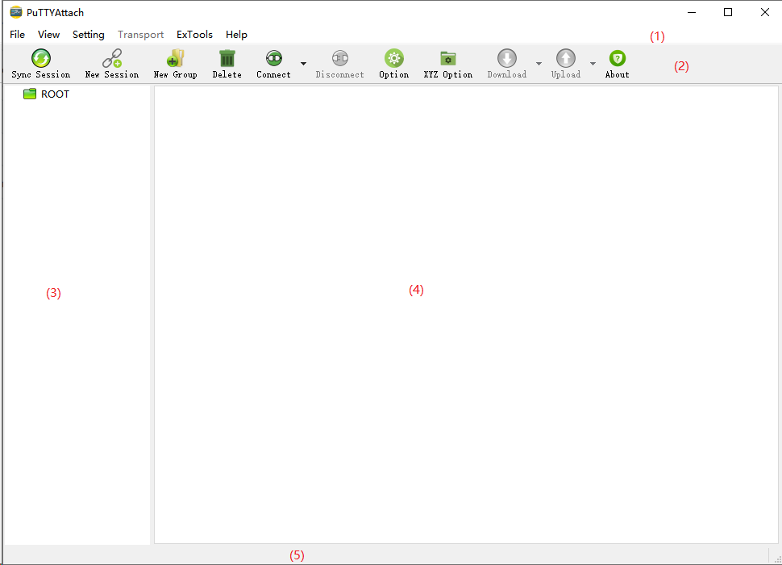
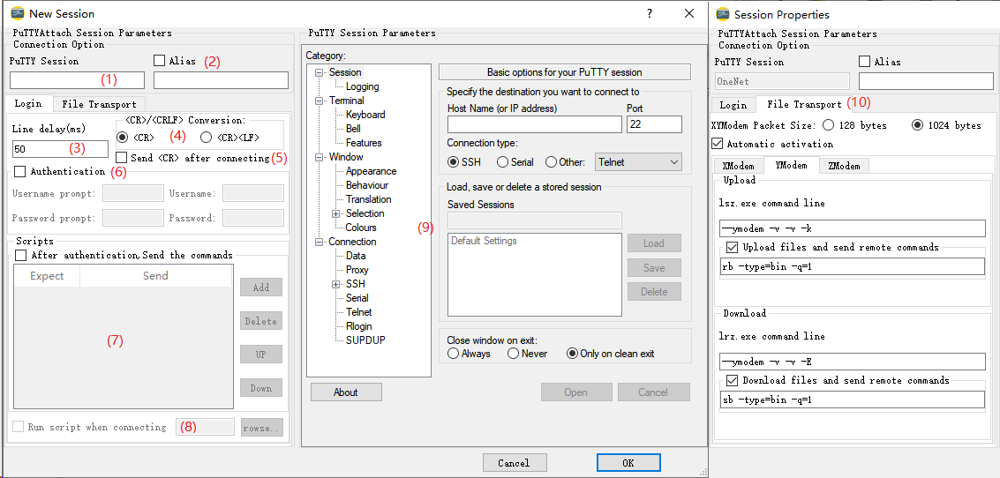
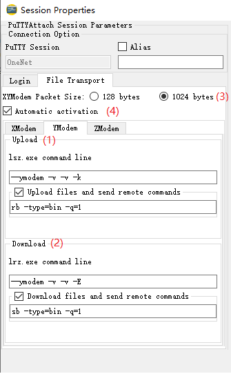
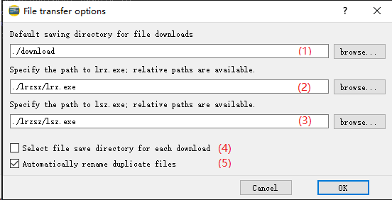

# PuTTYAttach 帮助文档

### 一、主页面

PuTTYAttach初始主页面如下

(1) 菜单栏

(2) 工具栏

(3) PuTTY会话列表

(4) 连接的PuTTY终端

(5) 状态栏，显示PuTTY会话的简要配置。

#### 1.1 工具栏

**(1) 同步会话**

同步PuTTY的会话到PuTTYAttach。

PuTTY是一个外部独立的程序，可直接管理其自身会话(一般保存在./sessions目录或注册表中)。

这可能会出现PuTTYAttach保存的会话与PuTTY自身会话不同步，"同步会话"功能会把PuTTY的会话同步到PuTTYAttach。

**(2) 新建会话**

新建一个PuTTYAttach会话，同时在PuTTY中创建此会话。

**(3) 新建组**

在会话列表新建一个文件夹，对会话分组管理。

**(4) 删除**

删除PuTTYAttach会话或会话组(文件夹)。

(5) 连接

连接会话列表中选中的会话，或连接下拉菜单中的会话。

**(6) 断开**

断开当前标签的已连接终端。

(7) 首选项

PuTTYAttach的主要配置项。

**(8) 传输选项**

[lrzsz](https://github.com/hfcjx/lrzsz)外部程序的相关配置。

**(9) 文件下载**

XModem，YModem，ZModem 协议文件下载。需要与[pipPuTTY](https://github.com/hfcjx/pipPuTTYcn)协同实现。

**(10) 文件上传**

XModem，YModem，ZModem 协议文件上传。需要与[pipPuTTY](https://github.com/hfcjx/pipPuTTYcn)协同实现。

**(11) 关于**

PuTTYAttach 关于对话框。

#### 1.2 菜单栏

菜单栏与工具栏基本一致，除了下面两个菜单。

(1) PuTTYAttach 页面布局设置

隐藏或显示"会话列表"; 

隐藏或显示"工具栏";

 隐藏或显示"菜单栏"。

(2) 罗列外部工具

把你常用的工具软件或其快捷方式复制到 ./exTools 目录，PuTTYAttach 为你将其添加到此菜单中，可快捷地打开对应的软件。

#### 1.3 会话列表

主页面左侧是会话列表，罗列PuTTYAttach的所有会话，会话保存在 ./session.json 文件中。

如上图所示，创建文件夹可分组管理会话。

双击会话将连接会话，右键双击修改会话配置。

#### 1.4 多标签

在标签头右击可弹出PuTTY的系统菜单。

拖放文件到终端窗口，弹出文件上传菜单。(注:需要[pipPuTTY](https://github.com/hfcjx/pipPuTTYcn)协同)

### 二、首选项

所有参数保存在./setting.json文件中。

(1) PuTTY程序文件的路径；相对路径也是有效的。

(2) PuTTY会话文件保存的目录。

[PuTTY for win32 storing configuration into file (kotrla.net)](https://jakub.kotrla.net/putty/) 把原始版本PuTTY保存在注册表的会话保存到文件，这里设置保存这些文件的目录。

(3) 等待putty.exe 启动时间。

启动时间超时，PuTTYAttach认为putty.exe启动失败。

(4) PuTTYAttach退出时保存

1) 程序布局 :  会话列表，工具栏，菜单栏的布局。

2) 已打开的会话 : PuTTYAttach退出时，连接的会话。

(5) 同时删除PuTTY会话

PuTTYAttach创建的会话参数保存在./session.json 文件，而PuTTY自身的会话参数保存在 (2) 选项的目录中。

删除会话时首先删除./session.json 文件中的会话，勾选此项会在 (2) 选项的目录删除PuTTY保存的会话。

### 三、新建会话

**(1) 会话名称**

这是一个重要的参数，./session.json 文件的会话参数与PuTTY自身会话参数通过会话名称关联。

输入会话名称后将同步发送到PuTTY程序的会话名称输入框中，PuTTY以此名称保存自身会话参数。

**(2) 别名**

终端标签的标签头一般显示会话名。

设置别名并勾选，标签头会显示别名。

**(3) 线路延迟**

通信线路的时延。身份验证发送用户名，密码之间的发送间隔，命令序列两条命令之间的发送间隔，由此参数决定。

**(4) 命令<CR>/<LF>转换**

命令默认是以回车<CR>结尾的，选择<CR><LF>项,命令将以<CR><LF>结尾，发送给远端。

**(5) 连接后发送<CR>**

一些服务器(如串口通信)，身份验证使用提示方式是无法自动触发的。

连接后发送<CR>触发"自动身份验证"和"自动发送命令序列"。

**(6) 身份验证**

勾选此项，终端连接后，依次发送用户名，密码验证身份，登录远端服务器。

这里输入的密码会简单加密保存在./session.json文件中，加密强度不高，如有严格的安全要求不要使用此功能。

**(7) 发送命令序列**

勾选此项，执行自动身份验证后，依顺序发送序列里的命令。

**(8) 连接时运行脚本**

登录脚本。勾选此项，执行自动身份验证后，运行此脚本。

此功能V1.0版还不支持，计划往后的版本中实现。

**(9) PuTTY程序配置界面**

PuTTY自身会话的参数配置，与PuTTY单独使用时一致。

**(10) 文件传输**

会话有关文件传输的参数，包括XModem，YModem，ZModem。

文件传输需要[lrzsz](https://github.com/hfcjx/lrzsz)协同实现。

#### 3.1 自动身份验证

自动身份验证有两种方式，提示方式，延时方式。

**提示方式**

用户名提示，远端服务器发送的输入用户名的提示字符。如 "login as:"。

密码提示，远端服务器发送的输入密码提示字符。如 "password:"。

终端连接后等待远端服务器发送用户名提示并发送用户名，等待远端发来密码提示发送密码，完成身份登录验证。

注：需要与[pipPuTTY](https://github.com/hfcjx/pipPuTTYcn)协同实现。

**延时方式**

"用户名提示" 和 "密码提示" 置空。

终端连接后发送用户名，等待2倍线路延迟，发送密码完成身份登录验证。

密码用命令行方式传递到PuTTY会直接泄露，PuTTYAttach不采用此方式；而是通过模拟键盘按键方式发送到PuTTY。

#### 3.2 自动发送命令序列

**"Add按钮"** 新增一行

**"Delete按钮"** 删除选中行

**"Up按钮"** 向上移动选中行

**"Down按钮"** 向下移动选中行

**"Expect列"**  等待命令期待的字符串，然后发送命令。

**"Send列"** 具体命令

"Expect列" 为空，以延时方式按顺序发送命令。

"Expect列" 不为空，需要与[pipPuTTY](https://github.com/hfcjx/pipPuTTYcn)协同实现。

命令序列同样通过模拟键盘按键方式发送到PuTTY。

#### 3.3 登录脚本

此功能V1.0版还不支持，计划往后的版本中实现，需要与[pipPuTTY](https://github.com/hfcjx/pipPuTTYcn)协同实现。

#### 3.4 XYZModem

**(1) 文件上传设置**

XModem,YModem,ZModem的文件上传设置是相同的。

**"lsz.exe命令行"**  

启动lsz.exe时的命令行参数，参数的意义通过命令 "lsz --help" 查看。

**“上传文件前发送远端命令”** 

本地启动lsz.exe发送文件，远端启动XYModem接收文件才能完成文件上传。

这是启动远端XYModem接收的命令，在启动lsz.exe前发送到远端。

注：勾选自动激活，PuTTTAttach自动检测远端ZModem接收文件启动，一般情况下不需要设置。

**(2) 文件下载设置**

XModem,YModem,ZModem的文件下载设置是相同的。

**"lrz.exe命令行"**  

启动lrz.exe时的命令行参数，参数的意义通过命令 "lrz --help" 查看。

**“下载文件前发送远端命令”** 

本地启动lrz.exe接收文件，远端启动XYModem发送文件才能完成文件下载。

这是启动远端XYModem发送的命令，在启动lrz.exe前发送到远端。

注：lrzsz的ZModem已经实现"rz"命令发送，ZModem一般情况不需要设置。

**(3) 自动激活**

只对ZModem有效。

自动检测远端ZModem启动，启动本地lsz.exe或lrz.exe。

**(4) XYModem分组大小**

只对XModem，YModem有效。

分组大小，分别是128字节和1024字节。

### 四、文件传输设置

所有参数保存在./setting.json文件中。

(1) 下载文件默认保存目录。

(2) lrz.exe的路径。

(3) lsz.exe的路径。

(4) 每次下载文件都需要选择保存文件的目录。

(5) 下载文件时遇到重名文件，自动重命名。对应lrz.exe的命令行参数是"-E"。

### 五、文件上传与下载

(1) 传输过程信息。

(2) 异常或事件信息。

(3) 下载完成后打开下载文件保存目录。

(4) 窗口关闭后，lrzsz冗余信息保存到文件，文件是 lrzsz所在目录下的"PuttyAttach_lrzszLog.txt"。

### 【附录】

**(1)  原始PuTTY与pipPuTTY区别：**

pipPuTTY实现了与外部程序传入和传出数据，以此扩展:

1) 提示字符方式的身份认证和命令发送
2) 文件上传和下载。

| 功能                         | 原始PuTTY | pipPuTTY |
| ---------------------------- | --------- | -------- |
| 会话管理                     | ●         | ●        |
| 多标签                       | ●         | ●        |
| 自动身份认证(提示方式)       |           | ●        |
| 自动身份认证(延时方式)       | ●         | ●        |
| 自动发送命令序列(Expect方式) |           | ●        |
| 自动发送命令序列(延时方式)   | ●         | ●        |
| 脚本                         |           | ●        |
| 文件传输(XYZModem)           |           | ●        |

**(2）[lrzsz-win32](https://github.com/trzsz/lrzsz-win32)和[lrzsz](https://github.com/hfcjx/lrzsz)区别**

lrzsz-win32是原始版本lrzsz的win32编译版本。

[lrzsz-win32](https://github.com/trzsz/lrzsz-win32)和[lrzsz](https://github.com/hfcjx/lrzsz) 与 PuTTYAttach协同都可以实现文件的上传和下载。

[lrzsz](https://github.com/hfcjx/lrzsz) 对齐XModem，YModem，ZModem传输过程中打印的冗余信息，文件上传下载窗口展示的传输过程信息更详细。

**(3) PuTTYAttach 发布**

[hfcjx/PuTTYAttach: PuTTYAttach是一个基于Windows的应用程序，用于管理PuTTY会话，多标签显示；支持自动登录](https://github.com/hfcjx/PuTTYAttach)

